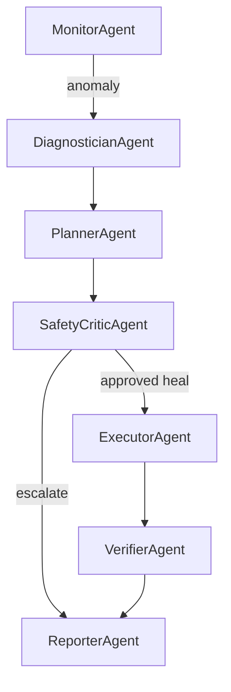

# AutoSRE
## Supervisor Multi-Agent Autonomous Ops System

## Overview

AutoSRE is a **supervisor-led multi-agent system** that detects infrastructure anomalies, collaborates on root cause analysis, and executes **policy-constrained self-healing** with full agent trace observability.

Manual triage for CPU saturation can take **~5 minutes MTTR**. AutoSRE reduces this to **~30 seconds** in simulation by routing incidents through specialist agents with deterministic safety overrides.

---
## Live Demo

https://autonomous-sre-agent.streamlit.app/

---

## Multi-Agent Architecture



| Agent | Type | Role |
|-------|------|------|
| **MonitorAgent** | Deterministic | Detects CPU/memory anomalies via Prometheus |
| **DiagnosticianAgent** | LLM + tools | Root cause analysis (metrics + container logs) |
| **PlannerAgent** | LLM | Proposes heal / escalate / wait |
| **SafetyCriticAgent** | **Rule-based** | Veto unsafe actions (cooldown, retry limits) |
| **ExecutorAgent** | Deterministic | Runs approved remediation (docker restart) |
| **VerifierAgent** | Deterministic | Confirms recovery via re-query |
| **ReporterAgent** | Template | Writes audit summary + agent trace |

**Key design:** The LLM never executes actions directly. Safety Critic must approve before Executor runs.

---

## Results (Simulated)

| Metric | Manual Baseline | AutoSRE |
|--------|----------------|---------|
| MTTR | ~5 min | ~30 sec |
| Success rate | N/A | 85%+ (demo) |
| Unsafe actions | N/A | 0 (safety veto) |
| Agent trace | None | Full pipeline per incident |

---

## Safety & Guardrails

* Deterministic Safety Critic overrides LLM proposals
* 60-second cooldown between heal actions
* Escalation after 2 failed recoveries (failure memory)
* Full agent trace stored in every incident report

---

## Tech Stack

* Python, LangGraph (supervisor orchestration)
* Gemini API (Diagnostician + Planner only)
* Docker Compose, Prometheus, cAdvisor
* Streamlit dashboard with agent trace timeline
* Kubernetes manifests (optional Minikube deploy)

---

## Setup

### 1. Clone and configure secrets

```bash
copy .env.example .env
# Edit .env and set GOOGLE_API_KEY (optional — rule-based fallback works without it)
```

### 2. Python environment

```bash
python -m venv venv
.\venv\Scripts\Activate.ps1   # Windows
pip install -r requirements.txt
```

### 3. Start infrastructure

```bash
docker compose up -d
```

### 4. Run the multi-agent pipeline

```bash
python -m core.runner
```

### 5. Launch dashboard

```bash
streamlit run frontend/dashboard.py
```

---

## Live Demo Workflow

Trigger a CPU spike, then run the agent:

```bash
python scripts/spike_cpu.py --duration 30
python -m core.runner
streamlit run frontend/dashboard.py
```

The dashboard **Agent Trace Timeline** shows Monitor → Diagnostician → Planner → Safety → Executor → Verifier → Reporter.

---

## Kubernetes (Optional Stretch)

Deploy nginx to Minikube:

```bash
minikube start
kubectl apply -f k8s/nginx-deployment.yaml
minikube service nginx --url
```

Full stack migration (Prometheus, agents) is future work — Docker Compose is recommended for demos.

---

## Interview Talking Points

1. **Why multi-agent?** Separation of concerns — monitoring is deterministic, diagnosis/planning use LLM, execution requires safety approval. Each step is auditable.

2. **What if the LLM is wrong?** Safety Critic is rule-based — enforces cooldowns, retry limits, and forced escalation. LLM never touches production directly.

3. **What makes this different?** Agent trace observability — interviewers can see *why* the system acted, not just *what* it did.

---

## Project Structure

```
agents/
  diagnostician_agent.py   # RCA via LLM
  planner_agent.py         # Action proposal
  safety_agent.py          # Deterministic veto layer
  executor_agent.py          # Remediation
  verifier_agent.py        # Recovery check
  reporter_agent.py        # Audit summary
  supervisor.py            # Routing logic
core/
  agent_state.py           # Shared state + agent_trace
  incident_graph.py        # LangGraph multi-agent pipeline
frontend/
  dashboard.py             # Agent trace timeline UI
scripts/
  spike_cpu.py               # Chaos trigger for demos
k8s/
  nginx-deployment.yaml    # Optional Minikube deploy
```

---

## Future Work

* Multi-metric reasoning (disk, latency, error rates)
* PagerDuty / Slack escalation from ReporterAgent
* Full Kubernetes-native deployment
* RAG over runbooks for DiagnosticianAgent

---

## How to Run (Quick Reference)

```bash
docker compose up -d
python -m core.runner
streamlit run frontend/dashboard.py
```
